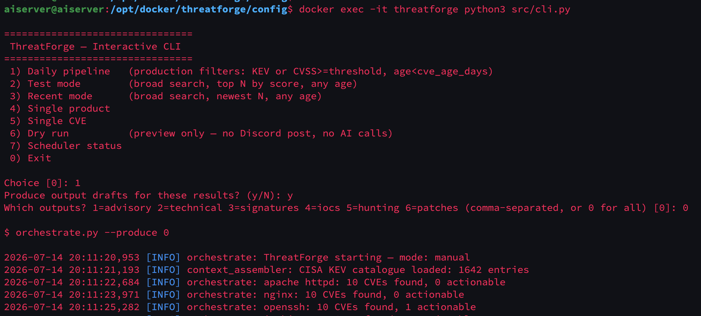
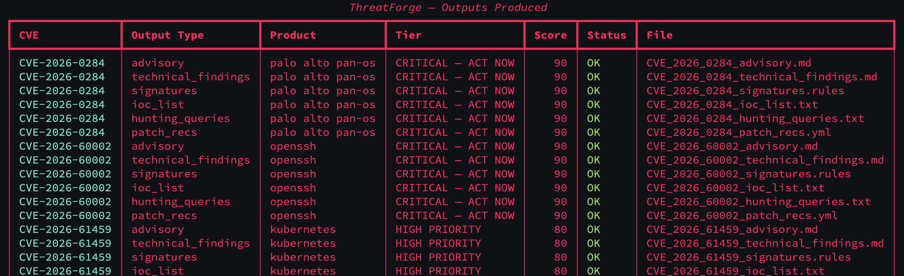
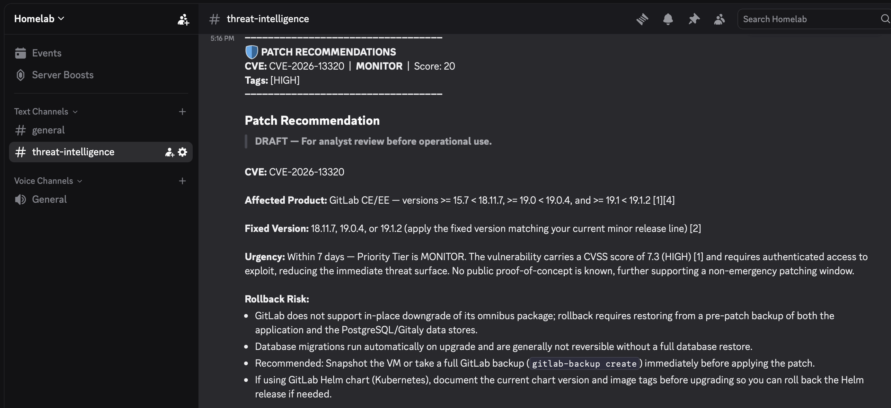
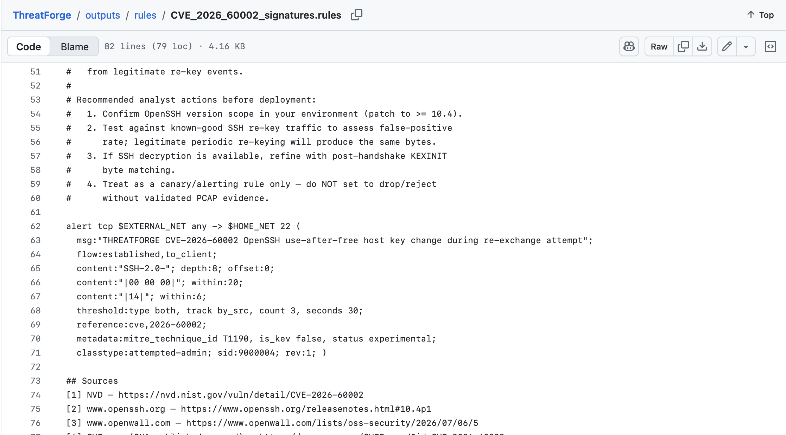
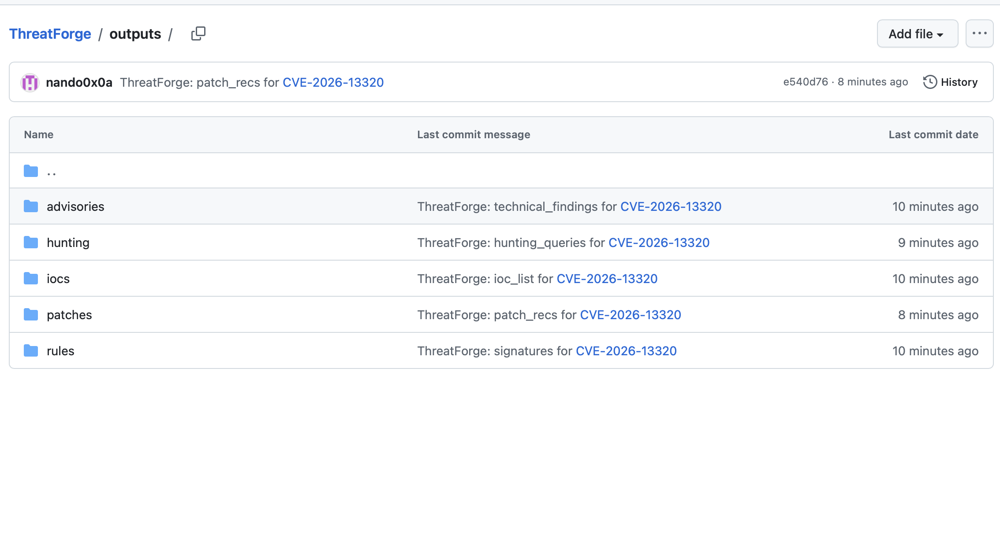

# ThreatForge

**CVE intelligence automation platform.** ThreatForge ingests vulnerability data, scores and prioritises it against real-world exploitation signals, and produces analyst-ready drafts — advisories, detection rules, IoC lists, hunting queries, patch playbooks — only when an analyst asks for them. Every output is a proposed draft, cited back to its sources. Nothing is deployed automatically.

---

## The problem

When a high-severity CVE lands, a detection engineer has to read the advisory, check CISA KEV for active exploitation, find PoC traffic patterns, and hand-write a Suricata rule, an advisory, a patch recommendation, and hunting queries — per CVE, per product, every day. ThreatForge automates the research and first-draft work so the analyst wakes up to a prioritised briefing and picks what to produce.

## How it works

1. **Pipeline** — queries [vulnx](https://github.com/projectdiscovery/vulnx) per product in `products.txt`, filters to what's actionable (recent + high severity, or KEV-listed regardless of age).
2. **Score & tag** — a composite model combining CISA KEV status, network-exploitable RCE detection, CVSS, EPSS, asset tier, PoC availability, and software prevalence. KEV + RCE together always means drop-everything priority.
3. **Verify** — cross-checks NVD/vulnx's CVSS score against the CVE Program's own CNA-published record; disagreements are surfaced explicitly, never silently resolved. Every fact-bearing output carries a numbered, deterministic source list.
4. **Brief** — posts a prioritised report to Discord and waits. No output is generated until the analyst selects one.
5. **Produce** — calls the configured AI backend only for the requested output types, saves them locally, and (optionally) commits them to a GitHub repo as a running audit trail.

## Features

- **CISA KEV-aware prioritisation** — confirmed in-the-wild exploitation overrides CVSS severity
- **Composite scoring** with a fully config-driven tag/weight system (`threatforge.yaml`, no code changes to retune)
- **Cross-source severity verification** — NVD vs. CVE.org/CNA, discrepancies flagged inline
- **Source-cited outputs** — every draft ends with a verified `## Sources` section, independent of model compliance
- **Pluggable AI backend** — Claude by default, or any OpenAI-compatible endpoint (local Ollama/LM Studio with no API key, OpenRouter, Groq, OpenAI cloud, ...)
- **GitHub-published audit trail** — every draft is committed to a repo, diffable and versioned
- **Interactive CLI wizard** (`src/cli.py`) plus broad spot-check modes (`--test`, `--recent`) for validating against CISA KEV / cve.org
- **Scheduler is opt-in** — fully analyst-driven by default; enable a daily cron run only if you want it

## See it in action

**Interactive CLI wizard** — pick a run mode, produce outputs, no flags to memorize:



**Summary table** — printed after every `--produce` run, one row per generated draft:



**Discord briefing** — every produced draft is posted directly to the channel, source-cited and flagged if severity is disputed:



**Source-cited outputs** — a generated Suricata rule, published to GitHub, with an explicit confidence caveat and a verified source list:



**GitHub audit trail** — every draft type gets its own subfolder, one commit per generation:



## Output modules

| # | Module | Audience |
|---|---|---|
| 1 | Security advisory | CISO / management |
| 2 | Technical findings | SOC analyst |
| 3 | Suricata signature draft | Detection engineer |
| 4 | IoC list | SOC / threat hunter |
| 5 | Threat hunting queries (CrowdStrike + nfdump) | SOC analyst |
| 6 | Patch recommendation + Ansible playbook | Ops / sysadmin |

## Quickstart

```bash
git clone git@github.com:nando0x0a/ThreatForge.git
cd ThreatForge
./setup.sh
```

`setup.sh` walks you through the required secrets (Anthropic API key, ProjectDiscovery API key, Discord webhook URL), builds the image, and starts the container. Everything else — pipeline filters, scoring weights, AI provider, prompts — lives in `config/threatforge.yaml` and is editable without a rebuild.

```bash
# Interactive wizard
docker exec -it threatforge python3 src/cli.py

# Or drive it directly
docker exec threatforge python3 src/orchestrate.py --dry-run
docker exec threatforge python3 src/orchestrate.py --produce 1,3,6
```

## Project layout

```
ThreatForge/
├── setup.sh
├── docker/                # Dockerfile, docker-compose.yml, entrypoint.sh
├── src/                   # pipeline, scoring, AI caller, notifier, GitHub publisher, CLI wizard
├── config/
│   ├── threatforge.yaml   # single source of truth: filters, scoring, prompts, output menu
│   └── products.txt       # tracked product/asset inventory
└── outputs/                # generated drafts (gitignored locally; published to GitHub separately)
```

## Documentation

- [`01_ThreatForge_Overview.md`](01_ThreatForge_Overview.md) — architecture, design principles, roadmap
- [`02_ThreatForge_Implementation.md`](02_ThreatForge_Implementation.md) — install, configuration, operating the container
- [`03_ThreatForge_Code.md`](03_ThreatForge_Code.md) — full source reference

## Status

Running in production in a homelab (Phase 1: single host, Discord + GitHub audit trail, analyst-triggered). See the [roadmap](01_ThreatForge_Overview.md#platform-roadmap) for planned Phase 2/3 work — chat-bot interactivity, persistent output storage, SIEM logging, and enterprise integrations (SOAR, MISP, ticketing).
